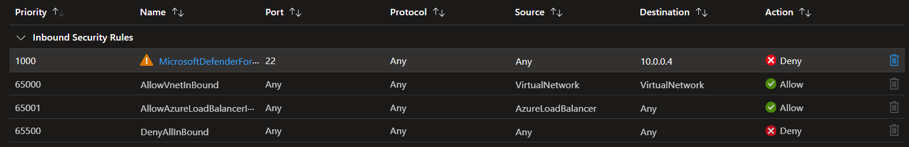
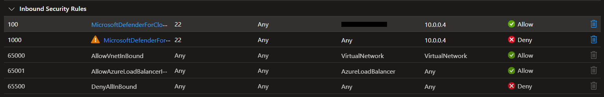

# Azure VM JIT access

Azure Virtual Machine (VM) with Just-in-Time access.

You'll need to enable [Microsoft Defender for Servers][1] for the Subscription.

Make sure you enable **Cloud Workload Protection (CWP)** for **Servers**. After that, install the agents using the Portal just for completeness.

Start by creating the sandbox infrastructure:

```sh
terraform init
terraform apply -auto-approve
```

The execution will fail with the following error:

```
'LinuxJITPolicy' is not onboarded to Defender For Servers offering.
```

Add the server to Defender and apply again to finish the setup.

## JIT

If everything goes right, the JIT policy will automatically be created to the VM by the Terraform AzApi provider.

Permissions required are:

- `Microsoft.Security/locations/jitNetworkAccessPolicies/initiate/action`
- `Microsoft.Compute/virtualMachines/read`

To be able to login with Entra ID credentials, users must have one of: 

- `Virtual Machine Administrator Login`
- `Virtual Machine User Login`

Defender should have created the following `Deny` rule:



Now request your JIT access.

Defender should create the following `Allow` rule:



## `VMAccess` extension

It is possible to extend VM management capabilities using the [VMAccess extension][2].

To install the extension using Terraform:

```sh
# VMAccess
install_vmaccess_extension = true
```

To check for deployed extensions and the installation status:

```sh
az vm extension list \
    --resource-group <resource-group> \
    --vm-name <vm-name> -o table
```

---

### Clean-up

Don't forget to disable Microsoft Defender if you're only testing.

Destroy the infrastructure:

```sh
terraform destroy -auto-approve
```


[1]: https://learn.microsoft.com/en-us/azure/defender-for-cloud/tutorial-enable-servers-plan
[2]: https://github.com/Azure/azure-linux-extensions/tree/master/VMAccess
