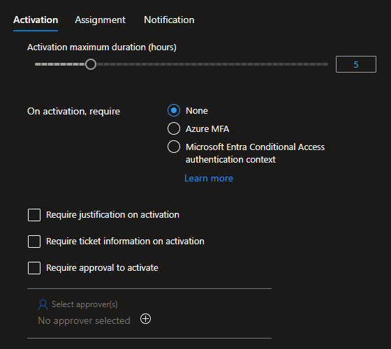
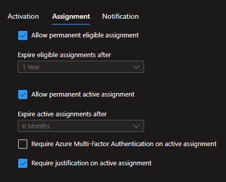
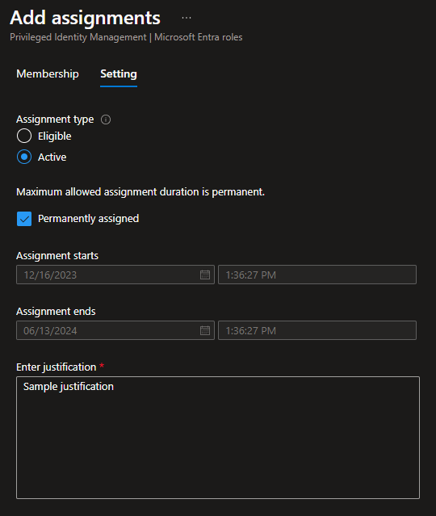
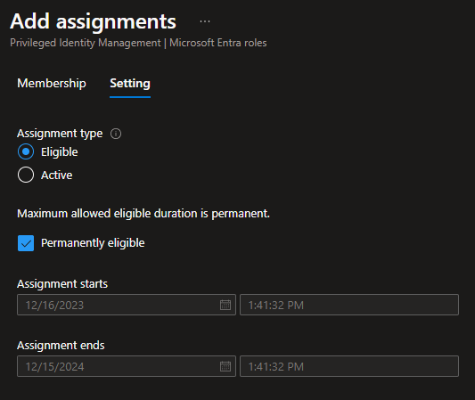

# Azure VM JIT access

Azure Virtual Machine (VM) with Just-in-Time access.

You'll need to enable [Microsoft Defender for Servers][1] for the Subscription.

Make sure you enable **Cloud Workload Protection (CWP)** for **Servers**. After that, install the agents using the Portal just for completeness.

Start by creating the sandbox infrastructure:

```sh
terraform init
terraform apply -auto-approve
```

The execution will fail with the following error:

```
'LinuxJITPolicy' is not onboarded to Defender For Servers offering.
```

Add the server to Defender and apply again to finish the setup.

## JIT

If everything goes right, the JIT policy will automatically be created to the VM by the Terraform AzApi provider.

Defender should have created the following `Deny` rule:


Now request your JIT access.

Defender should create the following `Allow` rule:


## PIM permissions

### Role settings

Settings you can require on `activation`:

- MFA, or conditional access authentication context
- Justification
- Ticket information
- Approval

Assignment:

- Allow permanent eligible assignment (or set to expire)
- Allow permanent active assignment (or set ot expire)
- Require Azure MFA on active assignment
- Require justification on active assignment

### Scenario

Here is a scenario for PIM assignment.

The following users will be created:

| Name     | Member of      |
|----------|----------------|
| User1    | Group1         |
| User2    | Group2         |
| User3    | Group1, Group2 |

> ℹ️ `Group1` and `Group2` are already created with PIM roles assignment enabled

To execute this PIM scenario, configure a role such as `Security Administrator` like this:





`Group1` assignment:



`Group2` assignment:




---

### Clean-up

Don't forget to disable Microsoft Defender if you're only testing.

Destroy the infrastructure:

```sh
terraform destroy -auto-approve
```


[1]: https://learn.microsoft.com/en-us/azure/defender-for-cloud/tutorial-enable-servers-plan

